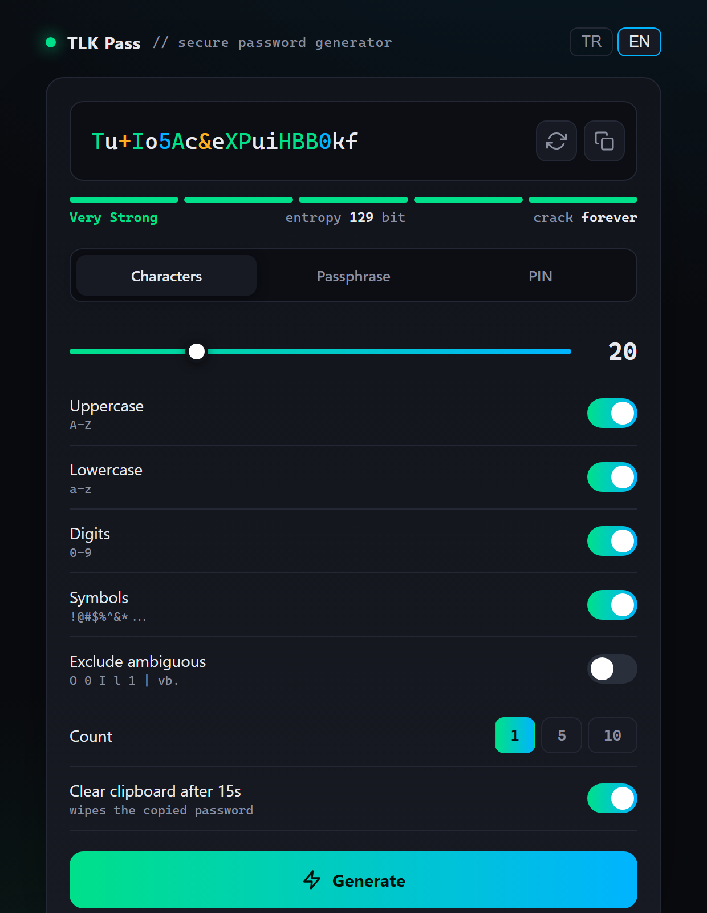

<p align="center">
  
</p>

<p align="center">
  <a href="https://talkdedsec.github.io/tlk-pass/"><b>Live demo</b></a>
  &nbsp;·&nbsp;
  <a href="#how-the-randomness-works"><b>How it works</b></a>
  &nbsp;·&nbsp;
  <a href="SECURITY.md"><b>Security</b></a>
  &nbsp;·&nbsp;
  <a href="README.tr.md"><b>Türkçe</b></a>
</p>

<p align="center">
  
  
  
  <a href="LICENSE"></a>
</p>

---

A password generator that is one HTML file. Open it and it works — from a web server, from a USB
stick, from a folder on a machine that has never seen a network. There is no build step, no bundle,
no package to install and nothing to trust beyond the file you are looking at.



## What it makes

| Mode | Range | Notes |
|:--|:--|:--|
| **Characters** | 6–64 | uppercase, lowercase, digits, symbols, each toggleable; at least one of every enabled class is guaranteed |
| **Passphrase** | 3–10 words | pick the separator, optionally capitalise each word and append two digits; words come from a 92-word list in the interface language |
| **PIN** | 3–12 digits | uniform, no repeated-digit shortcuts |

One, five or ten at a time, copied individually or in a batch. Entropy in bits and an estimated crack
time update as you move the sliders, `Enter` re-rolls, `Ctrl+C` copies. The interface is English and
Turkish: it opens in your browser's language, and the language you pick is remembered in
`localStorage` along with the slider positions.

## How the randomness works

Every random value comes from `crypto.getRandomValues`, which is the operating system's CSPRNG.
`Math.random()` is not called anywhere in the file — CI greps for it and fails the build if it ever
appears.

Turning a 32-bit random number into "a number from 0 to n-1" is where most generators quietly go
wrong. `x % n` is biased whenever `n` does not divide 2³² evenly: the low values come up slightly more
often than the high ones. This one rejects instead:

```js
const rand = n => {
  const max = Math.floor(0xffffffff / n) * n;   // the largest exact multiple of n
  const b = new Uint32Array(1);
  do { crypto.getRandomValues(b) } while (b[0] >= max);   // discard the remainder
  return b[0] % n;
};
```

Draws that land in the leftover tail are thrown away and redrawn, so every value is exactly as likely
as every other. The shuffle that mixes the guaranteed characters into the password is a
Fisher–Yates driven by the same function, so the guarantee does not leak position information.

### Entropy

The number under the password is the real one, not a scoring heuristic:

- **Characters** — `length × log₂(pool size)`. A 20-character password with all four classes on draws
  from an 88-character pool, so 20 × 6.46 ≈ **129 bits**.
- **Passphrase** — `words × log₂(92)`, plus `log₂(90)` if digits are appended. The English and Turkish
  lists are both 92 words, so the strength does not depend on the language.
- **PIN** — `digits × log₂(10)`.

The crack estimate assumes 10¹¹ guesses per second against an unsalted fast hash and halves the
keyspace for the average case. It describes an offline attack on a stolen hash, not someone typing at
a login form.

## Privacy

Nothing leaves the page. There is no analytics, no font CDN, no telemetry and no `fetch` — the file
contains zero external references, which is why it works with the machine offline. A Content Security
Policy of `default-src 'none'` is set in the document itself, so even a future edit that added a
network call would be blocked by the page's own header.

The only thing written anywhere is `localStorage.tlkpass`, holding your slider positions and, once
you pick one, your language. Generated passwords are never stored.

## Known limits

- **The wordlist is 92 words**, which is 6.5 bits per word. Five words is about 33 bits — the meter
  correctly calls that weak. Passphrase mode is here for something you have to type from memory; if
  you want strength per character, use character mode. A Diceware-sized list would put this at 12.9
  bits per word and is the obvious next change.
- **Clipboard auto-clear is best-effort.** After 15 seconds the page writes an empty string over the
  clipboard, but browsers only allow a clipboard write from a focused document. Switch tabs or
  applications before the timer fires and the clear is refused — your password stays on the
  clipboard. Treat it as tidiness, not as a security control.
- **`localStorage` is not encrypted.** It holds preferences only, but it is readable by anything with
  access to that browser profile.
- **A generator cannot protect a bad destination.** The password is only as safe as the site you
  paste it into and the manager you keep it in.

## Browser support

Tested in Chromium (Edge 141), on `https://` and on `file://`. It is not a wide-compatibility matrix,
so instead of a table of browsers I have not opened, here is what the file actually needs:

| Needs | Available since |
|:--|:--|
| `crypto.getRandomValues` | Chrome 11, Firefox 21, Safari 6.1 |
| `navigator.clipboard.writeText` | Chrome 66, Firefox 63, Safari 13.1 |
| CSS custom properties and flexbox | Chrome 49, Firefox 31, Safari 9.1 |
| optional `catch` binding | Chrome 66, Firefox 58, Safari 11.1 |

So anything from 2019 onwards should run it. The layout is one centred column capped at 540 px with
no breakpoints, which is why it reads the same on a phone as on a desktop. Where
`navigator.clipboard` is unavailable or blocked — which happens on `file://` in some builds —
copying falls back to a hidden textarea and `document.execCommand("copy")`, and the
15-second clear falls back with it.

## Use it

Open [the live demo](https://talkdedsec.github.io/tlk-pass/), or:

```bash
git clone https://github.com/Talkdedsec/tlk-pass
```

and double-click `index.html`. To carry it around, that one file is the whole program — copy it to a
USB stick. Nothing else in this repository is needed at runtime.

## Licence

[MIT](LICENSE).
