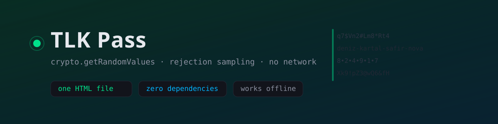
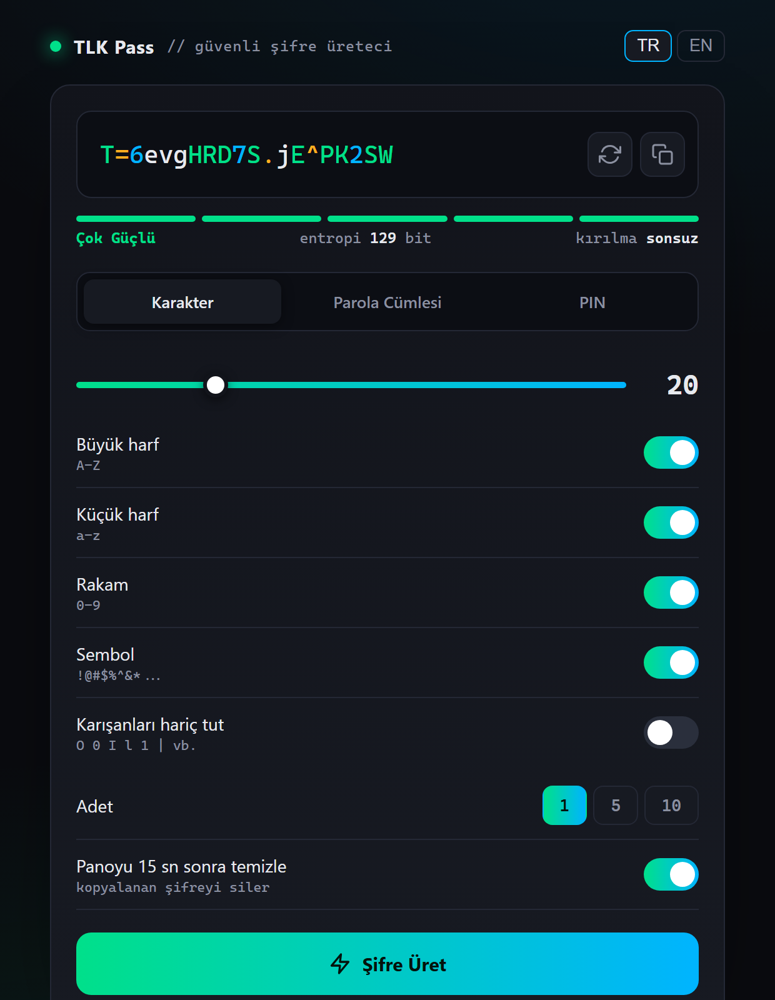

<p align="center">
  
</p>

<p align="center">
  <a href="https://talkdedsec1.github.io/tlk-pass/"><b>Canlı demo</b></a>
  &nbsp;·&nbsp;
  <a href="#rastgelelik-nasıl-çalışıyor"><b>Nasıl çalışıyor</b></a>
  &nbsp;·&nbsp;
  <a href="SECURITY.md"><b>Güvenlik</b></a>
  &nbsp;·&nbsp;
  <a href="README.md"><b>English</b></a>
</p>

<p align="center">
  
  
  
  <a href="LICENSE"></a>
</p>

---

Tek bir HTML dosyasından ibaret şifre üreteci. Aç, çalışır — sunucudan da, USB bellekten de, ağı hiç
görmemiş bir makinedeki klasörden de. Build adımı yok, bundle yok, kurulacak paket yok; baktığın
dosyanın dışında güvenmen gereken hiçbir şey yok.



## Ne üretiyor

| Mod | Aralık | Not |
|:--|:--|:--|
| **Karakter** | 6–64 | büyük harf, küçük harf, rakam, sembol; her biri açılıp kapanabilir ve açık olan her sınıftan en az bir karakter garanti |
| **Parola cümlesi** | 3–10 kelime | ayracı sen seçiyorsun, istersen her kelime büyük başlar ve sona iki rakam eklenir |
| **PIN** | 3–12 hane | düzgün dağılım, tekrar eden hane kısayolu yok |

Tek seferde 1, 5 ya da 10 üretim; tek tek ya da toplu kopyalama. Entropi (bit) ve tahmini kırılma
süresi sen slider'ı oynattıkça güncelleniyor, `Enter` yeniliyor, `Ctrl+C` kopyalıyor. Arayüz Türkçe ve
İngilizce; hem dil hem slider konumları `localStorage`'da hatırlanıyor.

## Rastgelelik nasıl çalışıyor

Her rastgele değer `crypto.getRandomValues`'tan, yani işletim sisteminin CSPRNG'sinden geliyor.
Dosyanın hiçbir yerinde `Math.random()` çağrılmıyor — CI bunu grep'liyor ve görürse build'i kırıyor.

32-bit bir rastgele sayıyı "0 ile n-1 arası bir sayı"ya çevirmek, çoğu üretecin sessizce yanlış
yaptığı yer. `x % n`, n sayısı 2³²'yi tam bölmediğinde yanlı: küçük değerler büyüklerden biraz daha
sık çıkıyor. Buradaki yöntem yanlılığı reddederek çözüyor:

```js
const rand = n => {
  const max = Math.floor(0xffffffff / n) * n;   // n'in tam katı olan en büyük değer
  const b = new Uint32Array(1);
  do { crypto.getRandomValues(b) } while (b[0] >= max);   // artan kuyruğu at
  return b[0] % n;
};
```

Artık kuyruğa düşen çekilişler atılıp yeniden çekiliyor, böylece her değerin olasılığı birebir aynı.
Garanti edilen karakterleri şifrenin içine dağıtan karıştırma da aynı fonksiyonla sürülen bir
Fisher–Yates; yani garanti, konum bilgisi sızdırmıyor.

### Entropi

Şifrenin altındaki sayı gerçek hesap, puanlama sezgisi değil:

- **Karakter** — `uzunluk × log₂(havuz)`. Dört sınıf da açıkken havuz 88 karakter, 20 karakterlik bir
  şifre 20 × 6,46 ≈ **129 bit**.
- **Parola cümlesi** — `kelime × log₂(92)`, rakam ekliyse artı `log₂(90)`.
- **PIN** — `hane × log₂(10)`.

Kırılma tahmini, tuzlanmamış hızlı bir hash'e karşı saniyede 10¹¹ deneme varsayıyor ve ortalama durum
için anahtar uzayını ikiye bölüyor. Çalınmış bir hash'e yapılan çevrimdışı saldırıyı anlatıyor, giriş
formuna tek tek deneme yapan birini değil.

## Gizlilik

Sayfadan hiçbir şey çıkmıyor. Analitik yok, font CDN'i yok, telemetri yok, `fetch` yok — dosyanın
içinde sıfır dış referans var, zaten bu yüzden makine çevrimdışıyken de çalışıyor. Belgenin kendi
içinde `default-src 'none'` içerikli bir Content Security Policy tanımlı, yani ileride biri ağ çağrısı
ekleyecek olsa bile sayfa kendi başlığıyla onu engelliyor.

Herhangi bir yere yazılan tek şey `localStorage.tlkpass`: dilin ve slider konumların. Üretilen
şifreler hiçbir yerde saklanmıyor.

## Bilinen sınırlar

- **Kelime listesi 92 kelime,** yani kelime başına 6,5 bit. Beş kelime yaklaşık 33 bit ediyor ve
  gösterge buna doğru şekilde "zayıf" diyor. Parola cümlesi modu ezberden yazılacak şifreler için
  var; karakter başına güç istiyorsan karakter modunu kullan. Diceware boyutunda bir liste bunu
  kelime başına 12,9 bite çıkarır ve yapılacak ilk değişiklik bu.
- **Pano temizliği garanti değil.** 15 saniye sonra sayfa panonun üstüne boş metin yazıyor, ama
  tarayıcılar panoya yazmaya yalnız odaktaki belgeye izin veriyor. Süre dolmadan sekme ya da uygulama
  değiştirirsen temizlik reddediliyor ve şifre panoda kalıyor. Bunu bir düzen alışkanlığı say,
  güvenlik önlemi değil.
- **`localStorage` şifreli değil.** İçinde yalnız tercihler var ama o tarayıcı profiline erişen her
  şey okuyabilir.
- **Üreteç kötü bir hedefi kurtaramaz.** Şifre, yapıştırdığın sitenin ve sakladığın yöneticinin
  güvenliği kadar güvenli.

## Tarayıcı desteği

Chromium'da (Edge 141) `https://` ve `file://` üzerinde test edildi. Geniş bir uyumluluk matrisi
değil, o yüzden açmadığım tarayıcıların tablosu yerine dosyanın gerçekte neye ihtiyacı olduğu:

| Gereken | Ne zamandan beri var |
|:--|:--|
| `crypto.getRandomValues` | Chrome 11, Firefox 21, Safari 6.1 |
| `navigator.clipboard.writeText` | Chrome 66, Firefox 63, Safari 13.1 |
| CSS custom property ve flexbox | Chrome 49, Firefox 31, Safari 9.1 |
| opsiyonel `catch` bağlaması | Chrome 66, Firefox 58, Safari 11.1 |

Yani 2019 sonrası her şey çalıştırır. Yerleşim, kırılma noktası olmayan, 540 px ile sınırlı tek bir
ortalanmış sütun; telefonda da masaüstündeki gibi okunmasının sebebi bu. `navigator.clipboard`'ın
olmadığı ya da engellendiği yerde — bazı derlemelerde `file://` için oluyor — kopyalama gizli bir
textarea ve `document.execCommand("copy")` ile yapılıyor, 15 saniyelik temizlik de onunla birlikte.

## Kullan

[Canlı demoyu](https://talkdedsec1.github.io/tlk-pass/) aç ya da:

```bash
git clone https://github.com/Talkdedsec1/tlk-pass
```

sonra `index.html`'e çift tıkla. Yanında taşımak için o tek dosya programın tamamı — USB belleğe
kopyala, yeter. Depodaki başka hiçbir şey çalışma anında gerekmiyor.

## Lisans

[MIT](LICENSE).
